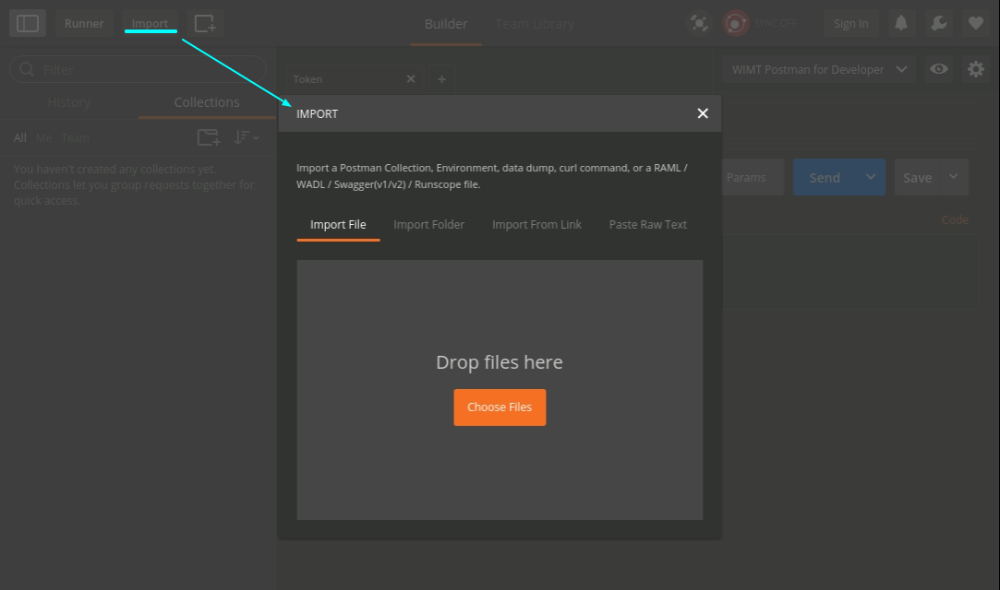
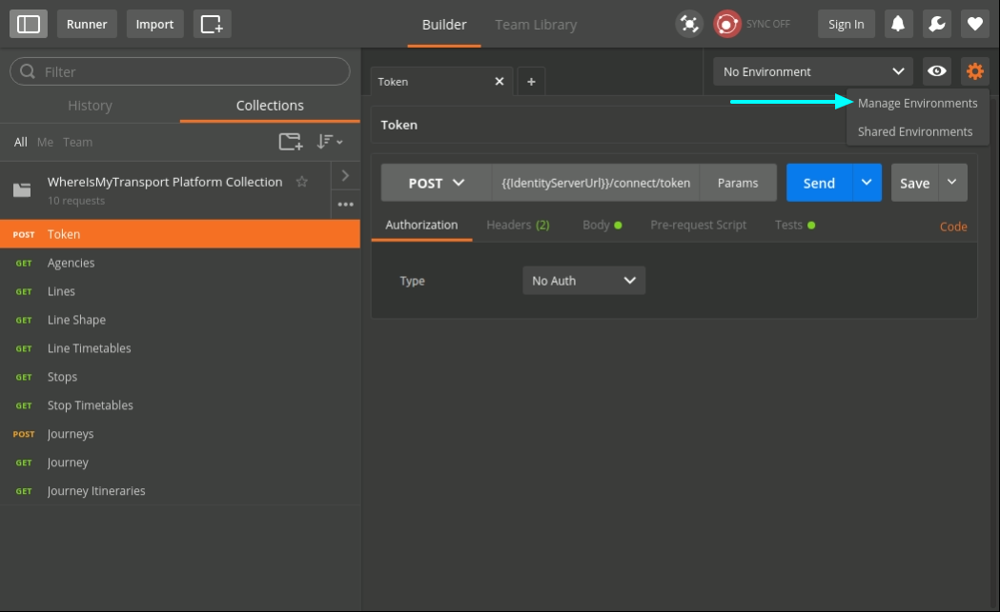
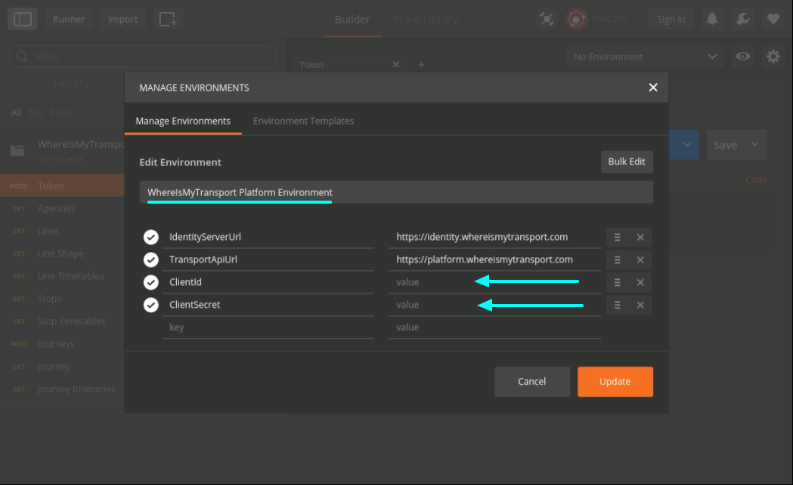
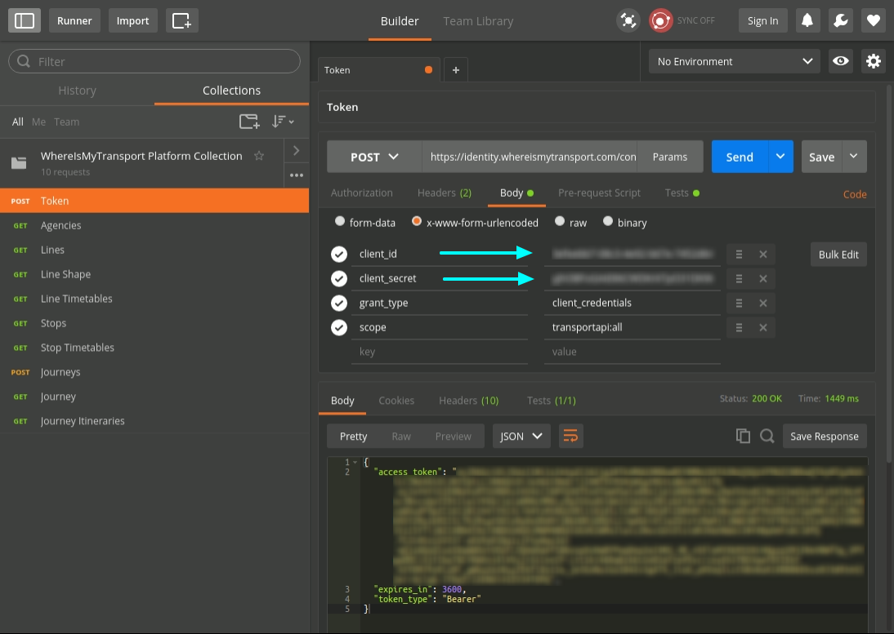

# Postman Collection

## Overview

This guide helps getting developers started with using the WhereIsMyTransport platform, using Postman. 

At the end of this guide you will have completed the following:

- Setup Postman (REST client)
- Create a Client for the WhereIsMyTransport platform
- Request a Token using the created Client
- Make API calls to the WhereIsMyTransport platform, using the acquired Token

## Setup Postman

1. Download [**Postman**](https://www.getpostman.com/)
2. Download the **WhereIsMyTransport** [Postman **Collection**](PlatformCollection.json)
3. Download the **WhereIsMyTransport** [Postman **Environment**](PlatformEnvironment.json)
4. Open Postman and Add the above **Collection** and **Environment** as follows:

    4.1 **Adding the Collection**
    
    Click the import button, and select the collection from where you downloaded it in the previous step.

    

    Once your collection has been loaded, you should see it in the left pane. This is a collection of REST API calls for the **WhereIsMyTransport** platform.

    

    4.2 **Adding the Environment**

    Click the settings button (top right), and click on **Manage Environments**. 
    On the dialog select the environment you downloaded in Step 3.

     
    
    Click on the environment to have a look at and edit the fields in the key-value pairs in the environment:
    
    

    Close the dialog and in the top right corner, select the corresponding environment from the dropdown list.

    Your environment is now setup correctly.

    To test it, select the first API call in the collection: **POST** token, and send the request. 
    
    You should see a response stating something along the lines of `error: invalid_client`. Don't worry, this means that Postman has been setup correctly. 
    
    The reason for this is that the **ClientId** and **ClientSecret** fields in the Postman Environment are blank.
    
    In the next step we will create client credentials, with which you can connect to the **WhereIsMyTransport** platform.
     
     
## Connect to our API

One needs to be authenticated in order to make API requests to the WhereIsMyTransport platform. 

For this you need to do the following:

1. Create a client on **WhereIsMyTransport** [Developer Portal](https://developer.whereismytransport.com/).

2. Copy the *ClientId* and *ClientSecret* into the respective fields of the postman environment.

3. From Postman, get a token, with the updated credentials, using the first API call in the collection, i.e. "**POST** Token". You should see a success response, along with a BearerToken response. This is automatically saved in the postman environment variables, and at this point you are authenticated to connect to the platform, until the token expires.

4. Now you can explore all the other API calls in the collection, and refer to our [Documentation](https://developer.whereismytransport.com/documentation) to see all possible parameters, etc.
