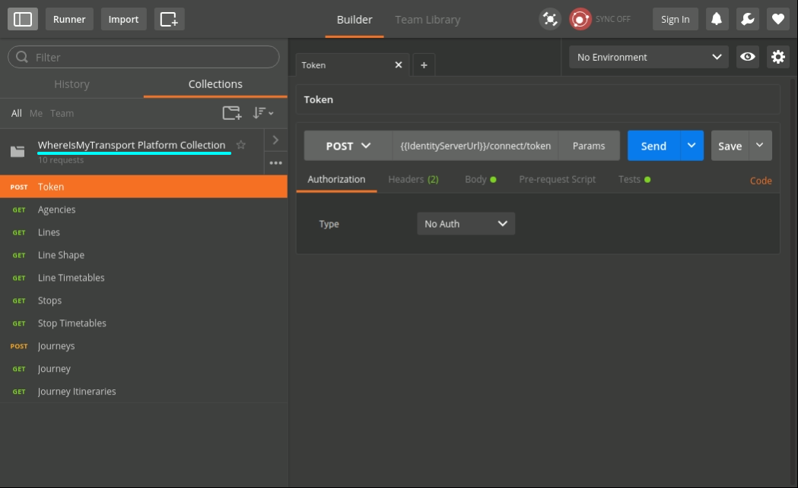
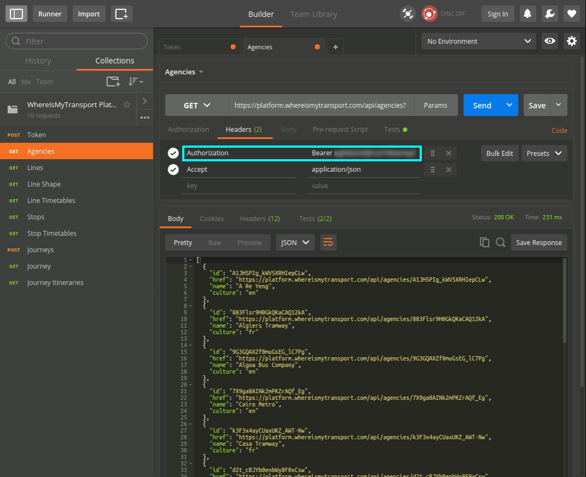

# Postman Collection

## Overview

This guide helps developers get started with the WhereIsMyTransport platform using Postman as the REST API Client application. 

At the end of this guide you will have completed the following:

- Setup Postman (REST client)
- Create a client for the WhereIsMyTransport platform
- Request a token using the created client
- Perform API requests to the WhereIsMyTransport platform, using the acquired token

## Setup Postman

1. Download [**Postman**](https://www.getpostman.com/)
2. Download the **WhereIsMyTransport** [Postman **Collection**](https://raw.githubusercontent.com/WhereIsMyTransport/docs/master/tapi/postman/PlatformCollection.json)
3. Open Postman and Add the above **Collection** and **Environment** as follows:

    3.1 **Adding the Collection**
    
    Click the import button, and select the collection from where you downloaded it in the previous step.

    

    Once your collection has been imported, you should see it in the left pane. This is a collection of REST API calls for the **WhereIsMyTransport** platform.

    

    To test it, select the first API call in the collection: **POST** token, and send the request. 
    
    You should see the response: `error: invalid_client`. Don't worry, this means that Postman has been setup correctly. 
    
    The reason for this is that the **ClientId** and **ClientSecret** fields in the Postman Environment are blank.
    
    In the next step we will create client credentials, with which you can connect to the **WhereIsMyTransport** platform.
     
     
## Connect to our API

You need to be authenticated in order to make an API request to the WhereIsMyTransport platform. 

To do this you need to do the following:

1. Create a Client on the **WhereIsMyTransport** [Developer Portal](https://developer.whereismytransport.com/).
    

2. Copy the *ClientId* and *ClientSecret* into the respective fields of the postman environment.
    

3. The first API call in the collection allows you to retrieve an access token. When using the updated credentials, you should see a `200` `OK` response. The response body contains the `BearerToken` field. This token is saved as a Postman environment variable. At this point you are authenticated and cann access our platform until the bearer token expires.
    

4. To use the token for the other API calls, specify the token as a header with `Authorization: Bearer {token}`. For a complete set of the API's endpoints, please see the full [documentation](https://developer.whereismytransport.com/documentation). Below is an example of how to retrieve a list of agencies using the bearer token.
    

And that's it. You can use the postman collection from here on, and use our [documentation](https://developer.whereismytransport.com/documentation) to explore of the capabilities of our API. Happy coding! 
